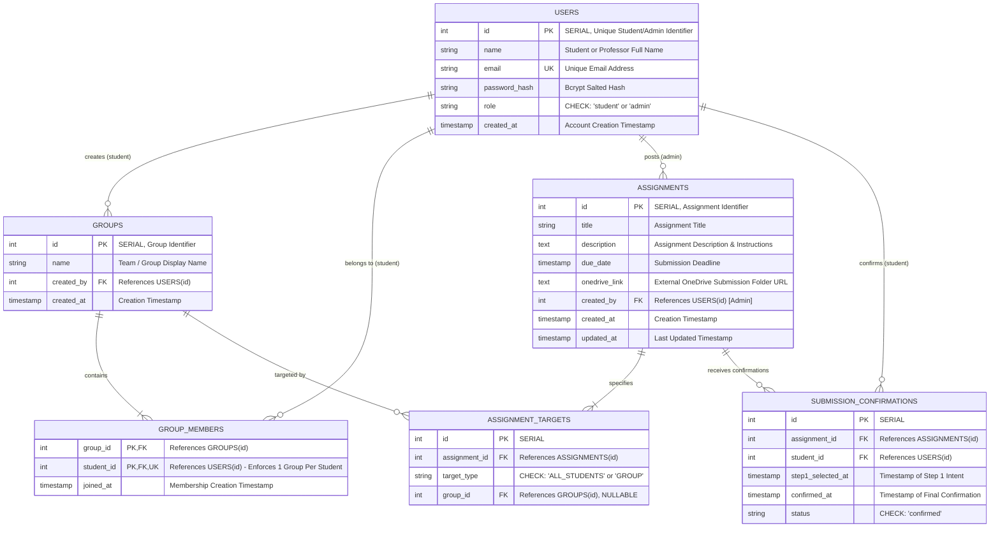

# Entity-Relationship (ER) Diagram

## Joineazy Student, Group & Assignment Management System

This document outlines the complete relational database design for the Joineazy system implemented in PostgreSQL.

---

## 1. Mermaid Entity-Relationship Diagram

---

## 2. Entity Dictionary & Schema Details

### 2.1 `users`
Represents all system actors (Students and Admins/Professors).
- `id` (INTEGER, PK, SERIAL): System generated identifier. Serves as the primary Student ID.
- `name` (VARCHAR(100), NOT NULL): Full name of the user.
- `email` (VARCHAR(255), UNIQUE, NOT NULL): Login and lookup identifier. Indexed.
- `password_hash` (VARCHAR(255), NOT NULL): 10-round bcrypt salted password hash. Never exposed in API responses.
- `role` (VARCHAR(20), NOT NULL): Role constraint `CHECK (role IN ('student', 'admin'))`.
- `created_at` (TIMESTAMP WITH TIME ZONE, DEFAULT CURRENT_TIMESTAMP).

### 2.2 `groups`
Represents student-formed collaborative assignment teams.
- `id` (INTEGER, PK, SERIAL): Unique group identifier.
- `name` (VARCHAR(100), NOT NULL): Name of the team (e.g. "Team Alpha").
- `created_by` (INTEGER, FK -> `users.id`, NOT NULL): The student who created the group.
- `created_at` (TIMESTAMP WITH TIME ZONE, DEFAULT CURRENT_TIMESTAMP).

### 2.3 `group_members`
Associative join entity defining group membership.
- `group_id` (INTEGER, FK -> `groups.id`, ON DELETE CASCADE): Target group.
- `student_id` (INTEGER, FK -> `users.id`, ON DELETE CASCADE): Enrolled student.
- `joined_at` (TIMESTAMP WITH TIME ZONE, DEFAULT CURRENT_TIMESTAMP).
- **Constraints**:
  - `PRIMARY KEY (group_id, student_id)`: Prevents duplicate membership in the same group.
  - `UNIQUE (student_id)`: **Crucial PRD Constraint** ensuring a student can belong to only one active group at a time.

### 2.4 `assignments`
Coursework posted by Admin (Professor) users.
- `id` (INTEGER, PK, SERIAL): Assignment identifier.
- `title` (VARCHAR(255), NOT NULL): Descriptive title.
- `description` (TEXT, NOT NULL): Guidelines, problem statements, and external submission requirements.
- `due_date` (TIMESTAMP WITH TIME ZONE, NOT NULL): Deadline.
- `onedrive_link` (TEXT, NOT NULL): External folder link where actual student files are deposited outside the app.
- `created_by` (INTEGER, FK -> `users.id`, NOT NULL): Admin creator reference.
- `created_at` (TIMESTAMP WITH TIME ZONE, DEFAULT CURRENT_TIMESTAMP).
- `updated_at` (TIMESTAMP WITH TIME ZONE, DEFAULT CURRENT_TIMESTAMP).

### 2.5 `assignment_targets`
Targeting rule definition determining assignment visibility.
- `id` (INTEGER, PK, SERIAL).
- `assignment_id` (INTEGER, FK -> `assignments.id`, ON DELETE CASCADE).
- `target_type` (VARCHAR(20), NOT NULL): `CHECK (target_type IN ('ALL_STUDENTS', 'GROUP'))`.
- `group_id` (INTEGER, FK -> `groups.id`, ON DELETE CASCADE, NULLABLE).
- **Check Constraint**: `((target_type = 'ALL_STUDENTS' AND group_id IS NULL) OR (target_type = 'GROUP' AND group_id IS NOT NULL))`.

### 2.6 `submission_confirmations`
Records student acknowledgment of having uploaded work to the external OneDrive location via the strict two-step in-app confirmation workflow.
- `id` (INTEGER, PK, SERIAL).
- `assignment_id` (INTEGER, FK -> `assignments.id`, ON DELETE CASCADE).
- `student_id` (INTEGER, FK -> `users.id`, ON DELETE CASCADE).
- `step1_selected_at` (TIMESTAMP WITH TIME ZONE, DEFAULT CURRENT_TIMESTAMP).
- `confirmed_at` (TIMESTAMP WITH TIME ZONE, DEFAULT CURRENT_TIMESTAMP).
- `status` (VARCHAR(20), NOT NULL, DEFAULT 'confirmed', `CHECK (status IN ('confirmed'))`).
- **Constraint**: `UNIQUE (assignment_id, student_id)` — strictly guarantees one confirmation per student per assignment.

---

## 3. Cardinality & Relationship Matrix

| Relationship | Type | Enforcement Mechanism |
| :--- | :--- | :--- |
| `users` (Admin) → `assignments` | 1 to Many | `assignments.created_by` FK referencing `users(id)` |
| `users` (Student) → `groups` (Creator) | 1 to Many | `groups.created_by` FK referencing `users(id)` |
| `groups` ↔ `users` (Members) | Many to Many | `group_members` join table with `UNIQUE(student_id)` constraint |
| `assignments` ↔ `groups` (Targets) | Many to Many | `assignment_targets` join table referencing `groups(id)` |
| `assignments` → `submission_confirmations` | 1 to Many | `submission_confirmations.assignment_id` FK |
| `users` → `submission_confirmations` | 1 to Many | `submission_confirmations.student_id` FK |
| `(assignment_id, student_id)` | Unique Pair | `UNIQUE (assignment_id, student_id)` constraint |

---

## 4. Indexing Strategy

To guarantee sub-millisecond query performance and eliminate full table scans during joins and aggregations:
1. `idx_users_email`: B-tree index on `users(email)` for fast authentication and member lookup.
2. `idx_groups_created_by`: Index on `groups(created_by)`.
3. `idx_group_members_student_id`: Index on `group_members(student_id)` for instantaneous user group resolution.
4. `idx_group_members_group_id`: Index on `group_members(group_id)` for roster queries.
5. `idx_assignment_targets_assignment_id`: Index on `assignment_targets(assignment_id)`.
6. `idx_assignment_targets_group_id`: Index on `assignment_targets(group_id)` for visibility joins.
7. `idx_submissions_assignment_id`: Index on `submission_confirmations(assignment_id)` for progress aggregations.
8. `idx_submissions_student_id`: Index on `submission_confirmations(student_id)` for personal status checks.
