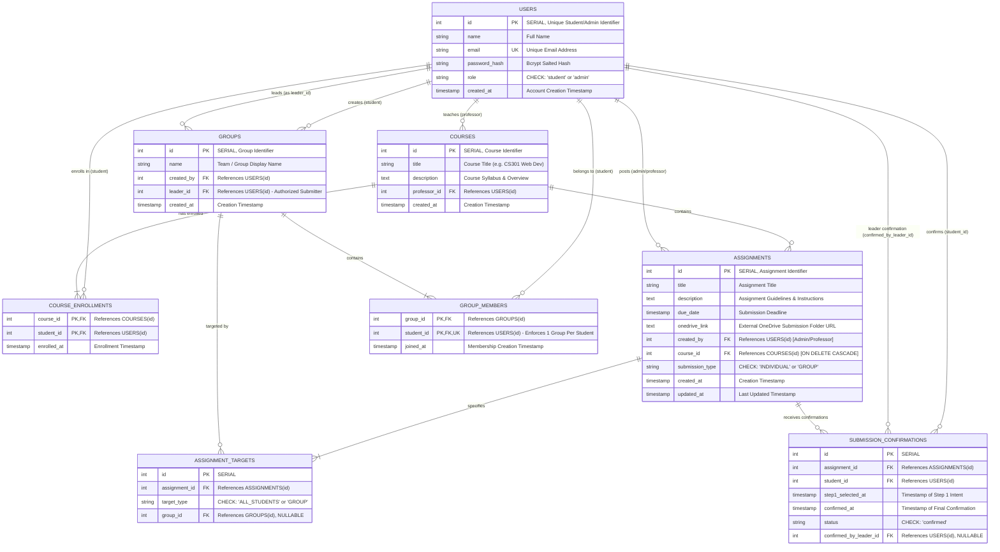

# Entity-Relationship (ER) Diagram
## Joineazy Student, Group, Course & Assignment Management System (Round 2)

This document outlines the complete relational database design for the Joineazy system implemented in PostgreSQL, updated with the **Round 2 Course Layer, Group Leadership, and Submission Types**.

---

## 1. Mermaid Entity-Relationship Diagram

---

## 2. Entity Dictionary & Schema Details

### 2.1 `users`
Represents all system actors (Students and Admins/Professors).
- `id` (INTEGER, PK, SERIAL): System generated identifier. Serves as primary user identifier.
- `name` (VARCHAR(100), NOT NULL): Full name of the user.
- `email` (VARCHAR(255), UNIQUE, NOT NULL): Login and lookup identifier. Indexed.
- `password_hash` (VARCHAR(255), NOT NULL): 10-round bcrypt salted password hash. Never exposed in API responses.
- `role` (VARCHAR(20), NOT NULL): Role constraint `CHECK (role IN ('student', 'admin'))`.
- `created_at` (TIMESTAMP WITH TIME ZONE, DEFAULT CURRENT_TIMESTAMP).

### 2.2 `courses` *(Round 2)*
Academic courses taught by professors and containing enrolled students.
- `id` (INTEGER, PK, SERIAL): Course identifier.
- `title` (VARCHAR(255), NOT NULL): Course title (e.g., "CS301: Modern Web Development").
- `description` (TEXT): Course overview, syllabus, or instructions.
- `professor_id` (INTEGER, FK -> `users.id`, ON DELETE CASCADE): Faculty member teaching the course.
- `created_at` (TIMESTAMP WITH TIME ZONE, DEFAULT CURRENT_TIMESTAMP).

### 2.3 `course_enrollments` *(Round 2)*
Associative join entity defining student enrollment in courses.
- `course_id` (INTEGER, FK -> `courses.id`, ON DELETE CASCADE).
- `student_id` (INTEGER, FK -> `users.id`, ON DELETE CASCADE).
- `enrolled_at` (TIMESTAMP WITH TIME ZONE, DEFAULT CURRENT_TIMESTAMP).
- **Constraints**: `PRIMARY KEY (course_id, student_id)`.

### 2.4 `groups` *(Updated for Round 2)*
Represents student-formed collaborative assignment teams.
- `id` (INTEGER, PK, SERIAL): Unique group identifier.
- `name` (VARCHAR(100), NOT NULL): Name of the team (e.g. "Team Alpha").
- `created_by` (INTEGER, FK -> `users.id`, NOT NULL): The student who created the group.
- `leader_id` (INTEGER, FK -> `users.id`, NULLABLE): **Round 2 Addition**. Designated group leader authorized to execute group submissions on behalf of all team members.
- `created_at` (TIMESTAMP WITH TIME ZONE, DEFAULT CURRENT_TIMESTAMP).

### 2.5 `group_members`
Associative join entity defining group membership.
- `group_id` (INTEGER, FK -> `groups.id`, ON DELETE CASCADE): Target group.
- `student_id` (INTEGER, FK -> `users.id`, ON DELETE CASCADE): Enrolled student.
- `joined_at` (TIMESTAMP WITH TIME ZONE, DEFAULT CURRENT_TIMESTAMP).
- **Constraints**:
  - `PRIMARY KEY (group_id, student_id)`: Prevents duplicate membership in the same group.
  - `UNIQUE (student_id)`: **PRD Constraint** ensuring a student belongs to only one active group.

### 2.6 `assignments` *(Updated for Round 2)*
Coursework posted by Admin (Professor) users.
- `id` (INTEGER, PK, SERIAL): Assignment identifier.
- `title` (VARCHAR(255), NOT NULL): Descriptive title.
- `description` (TEXT, NOT NULL): Guidelines and problem statements.
- `due_date` (TIMESTAMP WITH TIME ZONE, NOT NULL): Deadline.
- `onedrive_link` (TEXT, NOT NULL): External folder link for submissions.
- `created_by` (INTEGER, FK -> `users.id`, NOT NULL): Professor creator reference.
- `course_id` (INTEGER, FK -> `courses.id`, ON DELETE CASCADE): **Round 2 Addition**. Associating assignment with parent course.
- `submission_type` (VARCHAR(20), NOT NULL, DEFAULT 'INDIVIDUAL'): **Round 2 Addition**. Constraint: `CHECK (submission_type IN ('INDIVIDUAL', 'GROUP'))`.
- `created_at` (TIMESTAMP WITH TIME ZONE, DEFAULT CURRENT_TIMESTAMP).
- `updated_at` (TIMESTAMP WITH TIME ZONE, DEFAULT CURRENT_TIMESTAMP).

### 2.7 `assignment_targets`
Targeting rule definition determining assignment visibility.
- `id` (INTEGER, PK, SERIAL).
- `assignment_id` (INTEGER, FK -> `assignments.id`, ON DELETE CASCADE).
- `target_type` (VARCHAR(20), NOT NULL): `CHECK (target_type IN ('ALL_STUDENTS', 'GROUP'))`.
- `group_id` (INTEGER, FK -> `groups.id`, ON DELETE CASCADE, NULLABLE).
- **Check Constraint**: `((target_type = 'ALL_STUDENTS' AND group_id IS NULL) OR (target_type = 'GROUP' AND group_id IS NOT NULL))`.

### 2.8 `submission_confirmations` *(Updated for Round 2)*
Records student acknowledgment of coursework submission via two-step in-app flow.
- `id` (INTEGER, PK, SERIAL).
- `assignment_id` (INTEGER, FK -> `assignments.id`, ON DELETE CASCADE).
- `student_id` (INTEGER, FK -> `users.id`, ON DELETE CASCADE).
- `step1_selected_at` (TIMESTAMP WITH TIME ZONE, DEFAULT CURRENT_TIMESTAMP).
- `confirmed_at` (TIMESTAMP WITH TIME ZONE, DEFAULT CURRENT_TIMESTAMP).
- `status` (VARCHAR(20), NOT NULL, DEFAULT 'confirmed', `CHECK (status IN ('confirmed'))`).
- `confirmed_by_leader_id` (INTEGER, FK -> `users.id`, NULLABLE): **Round 2 Addition**. For `GROUP` assignments, records the leader who initiated the transactional confirmation for the member.
- **Constraint**: `UNIQUE (assignment_id, student_id)`.

---

## 3. Cardinality & Relationship Matrix

| Relationship | Type | Enforcement Mechanism |
| :--- | :--- | :--- |
| `users` (Professor) → `courses` | 1 to Many | `courses.professor_id` FK referencing `users(id)` |
| `courses` ↔ `users` (Students) | Many to Many | `course_enrollments` join table with composite PK `(course_id, student_id)` |
| `courses` → `assignments` | 1 to Many | `assignments.course_id` FK referencing `courses(id)` |
| `users` (Leader) → `groups` | 1 to Many | `groups.leader_id` FK referencing `users(id)` |
| `groups` ↔ `users` (Members) | Many to Many | `group_members` join table with `UNIQUE(student_id)` constraint |
| `assignments` ↔ `groups` (Targets) | Many to Many | `assignment_targets` join table referencing `groups(id)` |
| `assignments` → `submission_confirmations` | 1 to Many | `submission_confirmations.assignment_id` FK |
| `users` → `submission_confirmations` | 1 to Many | `submission_confirmations.student_id` FK |
| `(assignment_id, student_id)` | Unique Pair | `UNIQUE (assignment_id, student_id)` constraint |

---

## 4. Indexing Strategy

1. `idx_courses_professor_id`: B-tree index on `courses(professor_id)` for professor dashboard lookups.
2. `idx_course_enrollments_student_id`: Index on `course_enrollments(student_id)` for student enrolled course lookups.
3. `idx_course_enrollments_course_id`: Index on `course_enrollments(course_id)` for enrollment counts.
4. `idx_groups_leader_id`: Index on `groups(leader_id)` for instantaneous leader authorization verification.
5. `idx_assignments_course_id`: Index on `assignments(course_id)` for course assignment listings.
6. `idx_submissions_confirmed_by_leader`: Index on `submission_confirmations(confirmed_by_leader_id)` for group audit queries.
7. `idx_submissions_assignment_id`: Index on `submission_confirmations(assignment_id)` for status filtering (`sc.id IS NOT NULL`).
8. `idx_submissions_student_id`: Index on `submission_confirmations(student_id)` for personal status lookups.
